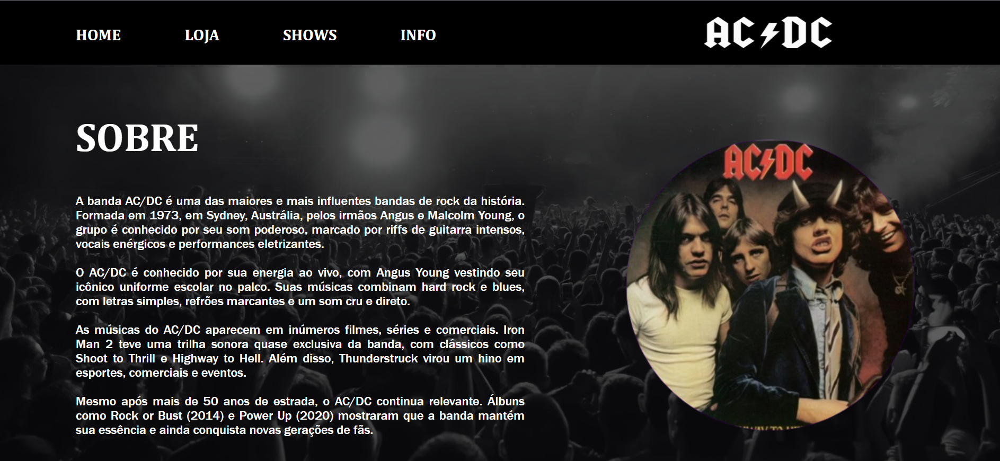

# **Projeto: Site do AC/DC** 🎸⚡

## Introdução  
Este projeto consiste na criação de um site simples em **HTML** e **CSS** para homenagear a lendária banda de rock **AC/DC**. O objetivo é aplicar conceitos básicos de desenvolvimento web, criando uma página visualmente atrativa e responsiva.

## Prototipagem
A prototipagem do projeto foi elaborada no Figma, permitindo a criação de um design interativo e visualmente estruturado antes do desenvolvimento em código.  

O Figma é uma plataforma online de design de interfaces e prototipação, amplamente utilizada para criar layouts de sites, aplicativos e outros produtos digitais.   
--> [Protótipo](https://www.figma.com/design/WFRYghlvXgp3b6zoKscCAO/Projetos-Front(Curso)?node-id=0-1&t=Km1kkmDWkTEVDesn-1)

## Tecnologias Utilizadas  
- **HTML**: Para a estrutura das páginas.  
- **CSS**: Para estilização, incluindo fontes personalizadas e um layout inspirado no estilo do rock.  
 

## Objetivos do Projeto  
✔ Praticar a criação de páginas web com **HTML e CSS**.  

Este projeto é ideal para quem deseja começar no **desenvolvimento web** e aprender a criar sites estilizados com **CSS puro**.

---