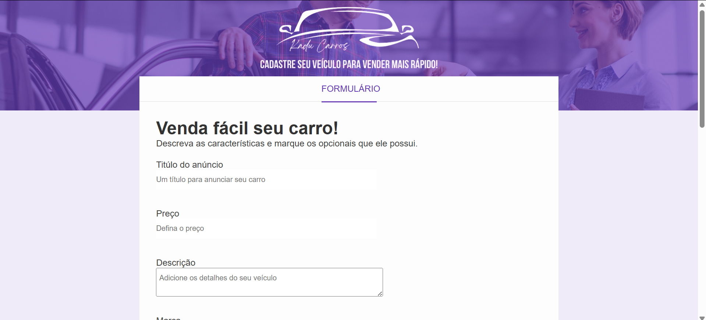

# **Projeto: Formulário Web**

## Introdução  
Este projeto tem como objetivo criar uma página web com um **formulário interativo**, utilizando **HTML** e **CSS** para aplicar conceitos de formulários e estilização responsiva. O formulário permitirá que os usuários preencham informações de maneira intuitiva e organizada.

## Prototipagem  
A prototipagem foi realizada no Figma, proporcionando uma visualização clara da estrutura e design antes da implementação.

O Figma é uma ferramenta essencial para a criação de interfaces interativas, permitindo o planejamento adequado do layout do formulário.

--> [Protótipo](https://www.figma.com/design/WFRYghlvXgp3b6zoKscCAO/Projetos-Front(Curso)?node-id=0-1&t=Km1kkmDWkTEVDesn-1)

## Tecnologias Utilizadas  
- **HTML**: Para a estrutura do formulário, incluindo campos de entrada, botoes e labels.  
- **CSS**: Para estilização, focando em usabilidade, responsividade e acessibilidade.  

## Objetivos do Projeto  
✔ Desenvolver um formulário interativo e acessível.  
✔ Explorar diferentes tipos de inputs e validação.  
✔ Aplicar boas práticas básicas de estilização para melhorar a experiência do usuário.  

Este projeto é ideal para aprimorar conhecimentos em **desenvolvimento web**, com foco na criação de formulários bem estruturados e agradáveis visualmente.

---

