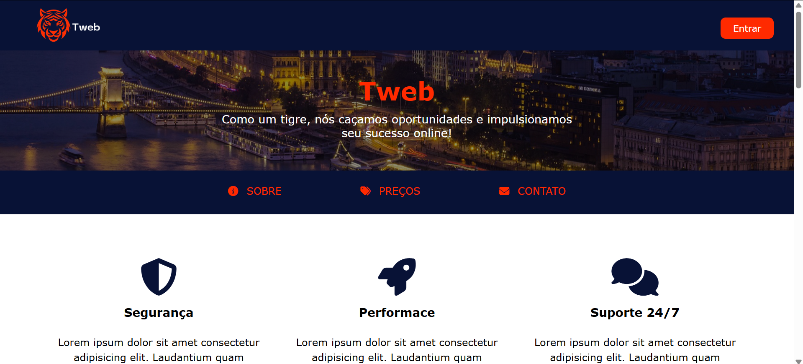

# **Projeto: Site Web**

## Introdução  
O objetivo deste projeto é criar um **site de hospedagem web simples**, utilizando **HTML** e **CSS** para explorar conceitos de layout, formulários e responsividade. O site permitirá que os usuários visualizem planos de hospedagem e preencham um formulário de contato de maneira fácil e organizada.

## Prototipagem  
A prototipagem foi feita no Figma, oferecendo uma visão clara da estrutura e do design do site antes da implementação. Isso permitiu um planejamento eficaz da experiência do usuário e dos componentes visuais.

O Figma foi utilizado para criar uma interface simples e responsiva, garantindo que o design se adaptasse bem a diferentes dispositivos.

--> [Protótipo](https://www.figma.com/design/WFRYghlvXgp3b6zoKscCAO/Projetos-Front(Curso)?node-id=0-1&t=Km1kkmDWkTEVDesn-1)

## Tecnologias Utilizadas  
- **HTML**: Para a estrutura do site, incluindo formulários, botões e seções de conteúdo.  
- **CSS**: Para estilização, focando em responsividade e um design clean e acessível.  

## Objetivos do Projeto  
✔ Criar um site de interface e responsivo para exibição de planos de hospedagem.  
✔ Desenvolver um formulário de contato simples e interativo.  
✔ Aplicar boas práticas de responsividade para garantir a acessibilidade em diferentes dispositivos.  

Este projeto é ideal para aprimorar conhecimentos em **desenvolvimento web**, com foco na criação de layouts responsivos e usabilidade.

---
