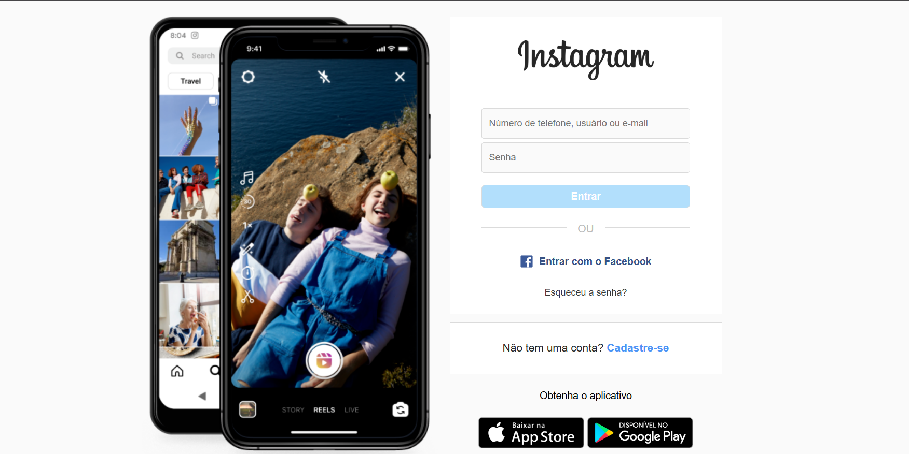

# **Projeto: Clone da Tela de Login do Instagram**

## Introdução  
Este projeto tem como objetivo recriar a **tela de login do Instagram**, utilizando **HTML** e **CSS** para explorar conceitos de **layout, responsividade e estilização**. O foco está em replicar o design original da página, garantindo uma experiência visual semelhante à versão oficial.

## Prototipagem  
A estrutura e o design foram analisados e recriados com base no layout original do Instagram. A prototipagem ajudou a definir os elementos essenciais da interface, como campos de entrada, botões e alinhamento responsivo.

## Tecnologias Utilizadas  
- **HTML**: Para a estrutura da página, incluindo os campos de login, botões e elementos visuais.  
- **CSS**: Para estilização, aplicando **Flexbox** e **Media Queries** para garantir a responsividade em diferentes dispositivos.  

## Objetivos do Projeto  
✔ Recriar a tela de login do Instagram com fidelidade ao design original.  
✔ Aplicar conceitos de **responsividade**, garantindo uma experiência fluida em diferentes telas.  
✔ Utilizar boas práticas de **CSS**, como organização modular e reutilização de estilos.  

Este projeto é ideal para reforçar conhecimentos em **HTML e CSS**, além de praticar a criação de layouts modernos e responsivos.

---
