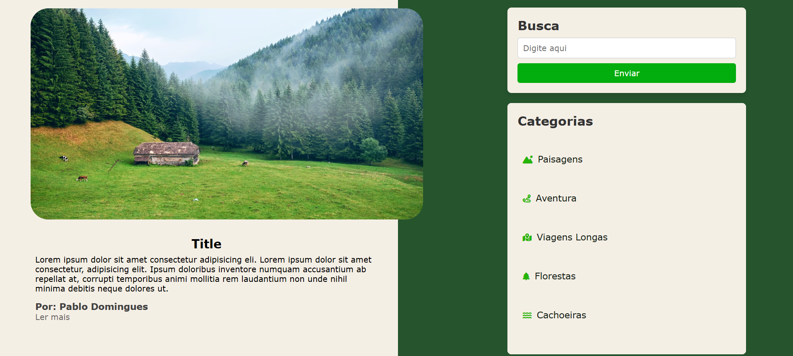

# **Projeto: Blog Responsivo com HTML e CSS Semântico**

## Introdução  
Este projeto tem como objetivo criar um **blog moderno e responsivo**, utilizando **HTML semântico** e **CSS** puro. A proposta é estruturar a página com elementos que facilitem a leitura, a organização e a acessibilidade do conteúdo, aplicando práticas recomendadas de desenvolvimento web.

## Prototipagem  
A prototipagem foi feita no Figma, oferecendo uma visão clara da estrutura e do design do site antes da implementação. Isso permitiu um planejamento eficaz da experiência do usuário e dos componentes visuais.

O Figma foi utilizado para criar uma interface simples e responsiva, garantindo que o design se adaptasse bem a diferentes dispositivos.

--> [Protótipo](https://www.figma.com/design/WFRYghlvXgp3b6zoKscCAO/Projetos-Front(Curso)?node-id=0-1&t=Km1kkmDWkTEVDesn-1)

## Tecnologias Utilizadas  
- **HTML5 Semântico**: Estruturação clara e acessível do conteúdo, com uso adequado de tags semânticas.  
- **CSS3**: Estilização moderna, com uso de **Flexbox**, **Media Queries** e boas práticas de design responsivo.  

## Objetivos do Projeto  
✔ Desenvolver um blog simples e funcional, com foco na legibilidade.  
✔ Explorar os principais elementos **semânticos do HTML5** para uma melhor organização do código.  
✔ Garantir a **responsividade** em diferentes tamanhos de tela (desktop, tablet, mobile).  
✔ Utilizar uma estrutura de CSS limpa e bem organizada, facilitando a manutenção e evolução do projeto.  

Este projeto é ideal para praticar **boas práticas de HTML e CSS**, entender a importância da semântica no desenvolvimento web e aplicar conceitos modernos de layout.

