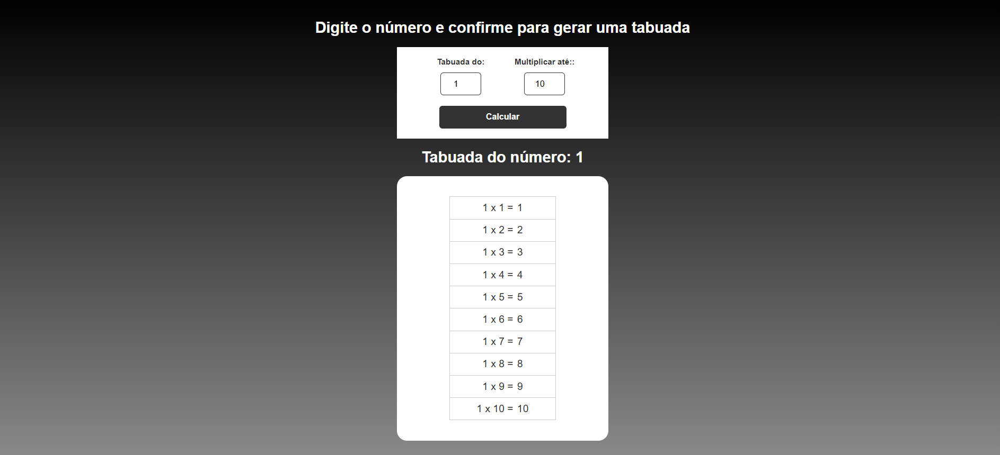

# **Projeto: Tabela de Tabuada Interativa**

## Introdução  
Este projeto tem como objetivo criar uma **tabela de tabuada dinâmica e responsiva**, onde o usuário pode selecionar um número e visualizar sua respectiva tabuada de forma clara e interativa. Foram utilizados **HTML, CSS e JavaScript** para desenvolver uma experiência prática e intuitiva, reforçando conceitos fundamentais do desenvolvimento web.

## Tecnologias Utilizadas  
- **HTML5**: Para estruturar os elementos da página, como o campo de seleção de número e a área de exibição da tabuada.  
- **CSS3**: Para estilização da interface, garantindo uma aparência agradável, organizada e **responsiva**.  
- **JavaScript**: Para gerar dinamicamente os resultados da tabuada com base na escolha do usuário.

## Objetivos do Projeto  
✔ Criar uma interface interativa para exibir tabuadas.  
✔ Praticar a manipulação do DOM com JavaScript.  
✔ Aplicar responsividade para diferentes tamanhos de tela.  
✔ Desenvolver uma tabela clara, legível e visualmente atrativa.  

Este projeto é ideal para reforçar o **uso de lógica básica em JavaScript**, explorar **interações com o DOM** e aplicar **estilização responsiva com CSS**, promovendo uma base sólida para projetos mais avançados.

---