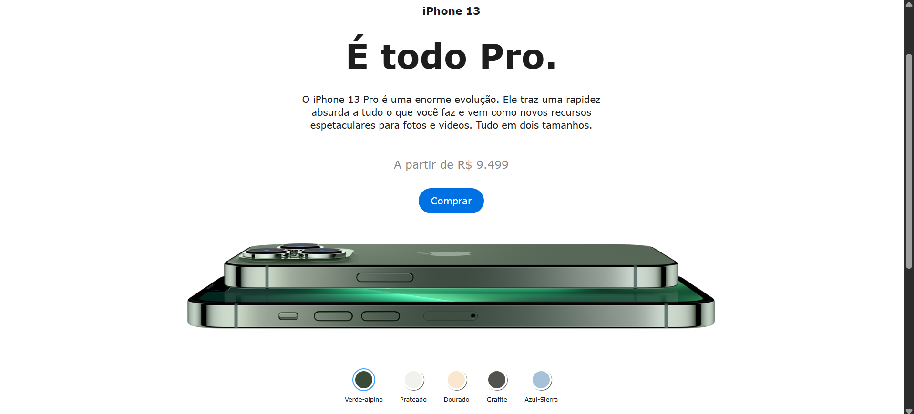

# **Projeto: Clone da Página do iPhone 13 Pro Max (Apple)**

## Introdução  
Este projeto tem como objetivo recriar a **página oficial da Apple do iPhone 13 Pro Max**, aplicando conceitos de **HTML, CSS, JavaScript** e **design responsivo**. A proposta é replicar o layout e algumas das interações da página original.

## Prototipagem  
A prototipagem foi baseada no **site oficial da Apple**, analisando a hierarquia dos elementos, o espaçamento, as animações e os efeitos visuais. O design foi reproduzido com atenção aos detalhes, garantindo um resultado próximo ao original.

## Tecnologias Utilizadas  
- **HTML5**: Estruturação semântica dos elementos da página, como seções, menus e destaques de produto.  
- **CSS3**: Estilização avançada, com ênfase em **responsividade**, **animações** e **transições visuais suaves**.  
- **JavaScript**: Responsável pelas interações dinâmicas, como efeitos de rolagem, menus interativos e respostas aos eventos do usuário.

## Objetivos do Projeto  
✔ Praticar a reprodução visual de uma página real e profissional.  
✔ Aprimorar habilidades em **CSS responsivo** e **JavaScript interativo**.  
✔ Aplicar os conceitos de **HTML semântico** em um projeto mais complexo.  
✔ Desenvolver uma experiência de usuário fluida e agradável, adaptável a diferentes dispositivos.  

Este projeto é ideal para exercitar a **atenção aos detalhes**, o **uso de boas práticas no front-end** e a criação de interfaces modernas e atrativas com foco em **design realista e responsivo**.

