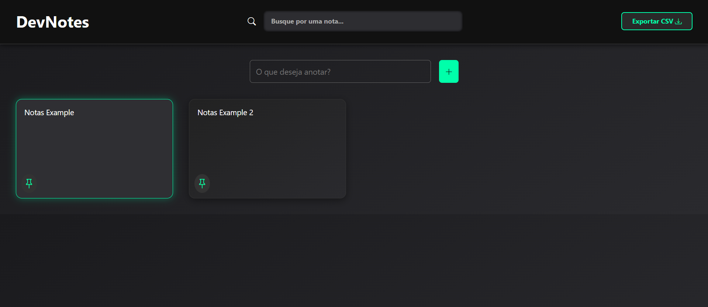

# **Projeto: Organizador de Notas com HTML, CSS e JavaScript**

## Introdução  
Este projeto tem como objetivo o desenvolvimento de um **organizador de notas completo**, no qual o usuário pode **criar, editar, excluir e exportar** anotações de forma intuitiva e eficiente. Utilizando **HTML, CSS e JavaScript**, a aplicação armazena os dados no **LocalStorage**, garantindo persistência mesmo após o fechamento do navegador.

## Prototipagem  
A interface foi planejada para ser **limpa, acessível e responsiva**, com foco na experiência do usuário. O layout inclui uma área de criação de notas, uma lista com ações rápidas (editar/excluir) e botões para exportar as anotações.

O protótipo foi inspirado em aplicações modernas de produtividade, com destaque para organização e simplicidade.

## Tecnologias Utilizadas  
- **HTML5**: Estruturação dos elementos da interface, incluindo campos de texto, botões e containers para exibição das notas.  
- **CSS3**: Estilização responsiva, com uso de **Flexbox**, **grid**, cores suaves e tipografia clara, visando conforto visual e usabilidade.  
- **JavaScript**: Responsável pela lógica de criação, edição, exclusão, exportação e persistência das notas no navegador por meio do **LocalStorage**.

## Funcionalidades Principais  
- ✅ **Criar nova nota** com título e conteúdo  
- ✅ **Editar notas existentes**  
- ✅ **Excluir notas** com confirmação de ação  
- ✅ **Salvar automaticamente no LocalStorage**  
- ✅ **Exportar notas** em formato `.txt` ou `.json`  
- ✅ **Interface dinâmica e responsiva**  
- ✅ **Filtro de busca por palavra-chave** *(opcional)*  
- ✅ **Marcar notas como favoritas** *(opcional)*

## Objetivos do Projeto  
✔ Aplicar o conceito de **CRUD (Create, Read, Update, Delete)** em JavaScript puro.  
✔ Praticar **manipulação de DOM**, **eventos** e **armazenamento local** com `LocalStorage`.  
✔ Garantir uma **boa experiência do usuário**, com visual moderno e navegação simples.  
✔ Implementar funções úteis de exportação para aumentar a **versatilidade da aplicação**.  
✔ Estimular a organização pessoal por meio de uma ferramenta prática.

Este projeto é ideal para praticar o desenvolvimento de **aplicações web interativas** com foco em **produtividade**, além de consolidar conhecimentos de front-end e **persistência de dados no navegador**.

