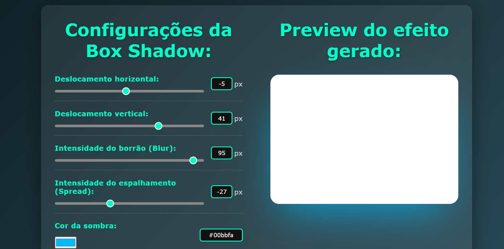

# **Projeto: Gerador de Shadow Box com HTML, CSS e JavaScript**

## Introdução  
Este projeto tem como objetivo desenvolver uma **ferramenta visual para criação de sombras em caixas (box-shadows)**, utilizando **HTML, CSS e JavaScript**. A aplicação permite ao usuário personalizar propriedades como deslocamento, desfoque, espalhamento e cor, visualizando as mudanças em tempo real e podendo copiar o código gerado.

## Prototipagem  
A interface foi idealizada com foco na **interatividade e visualização imediata**, apresentando sliders e campos de entrada para cada parâmetro do `box-shadow`, além de uma área de pré-visualização.

O layout é simples, intuitivo e responsivo, pensado para facilitar o aprendizado e a experimentação com CSS.

## Tecnologias Utilizadas  
- **HTML5**: Estruturação dos controles de entrada, visualização da caixa e área de cópia do código.  
- **CSS3**: Estilização dos elementos da interface e aplicação dinâmica das sombras conforme os parâmetros definidos.  
- **JavaScript**: Responsável por capturar os valores inseridos pelo usuário, atualizar o estilo da caixa em tempo real e gerar o código CSS correspondente.

## Funcionalidades Principais  
- ✅ Controle de **deslocamento horizontal e vertical**  
- ✅ Ajuste de **desfoque** e **espalhamento**  
- ✅ Escolha de **cor** da sombra  
- ✅ Alternância entre **sombra interna (inset)** ou externa  
- ✅ Geração automática do **código CSS** correspondente  
- ✅ **Botão para copiar** o código CSS  
- ✅ Interface **totalmente responsiva**

## Objetivos do Projeto  
✔ Permitir a criação visual de estilos de `box-shadow` para uso em projetos web.  
✔ Reforçar o uso de **eventos**, **manipulação de DOM** e **estilização dinâmica** com JavaScript.  
✔ Facilitar o entendimento das propriedades do `box-shadow` na prática.  
✔ Criar uma ferramenta útil tanto para iniciantes quanto para desenvolvedores que queiram gerar sombras de forma rápida.  
✔ Estimular a exploração criativa de estilos CSS.

Este projeto é excelente para praticar **interatividade com JavaScript**, integração entre **HTML, CSS e JS**, e criar uma ferramenta funcional com **aplicação direta em projetos de front-end**.

