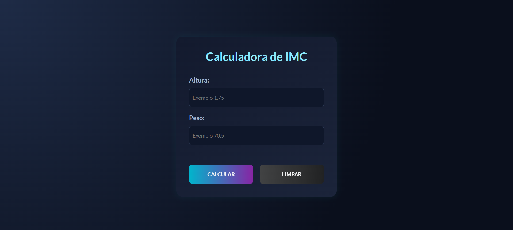

# **Projeto: Calculadora de IMC (Índice de Massa Corporal)**

## Introdução  
Este projeto tem como objetivo desenvolver uma **calculadora de IMC** utilizando **HTML, CSS e JavaScript**, permitindo que os usuários insiram seus dados de peso e altura para calcular automaticamente o índice de massa corporal e receber uma classificação correspondente.

A proposta é criar uma interface simples, acessível e funcional, que apresente os resultados de forma clara e imediata.

## Tecnologias Utilizadas  
- **HTML5**: Para estruturar os campos de entrada, botões e área de exibição dos resultados.  
- **CSS3**: Para estilização da interface, com foco na **clareza visual**, **cores indicativas de resultados** e **responsividade**.  
- **JavaScript**: Responsável por capturar os dados do usuário, realizar o cálculo do IMC e exibir a classificação (como abaixo do peso, peso ideal, sobrepeso, etc).

## Objetivos do Projeto  
✔ Permitir o cálculo do IMC com base em entradas do usuário.  
✔ Exibir resultados com mensagens informativas e visuais.  
✔ Estilizar a interface de forma moderna, leve e responsiva.  
✔ Aplicar lógica condicional em JavaScript de forma prática e funcional.  

Este projeto é ideal para praticar **interações básicas com o usuário**, **validações simples de dados**, **lógica de programação** e a **construção de interfaces funcionais** com tecnologias web fundamentais.

