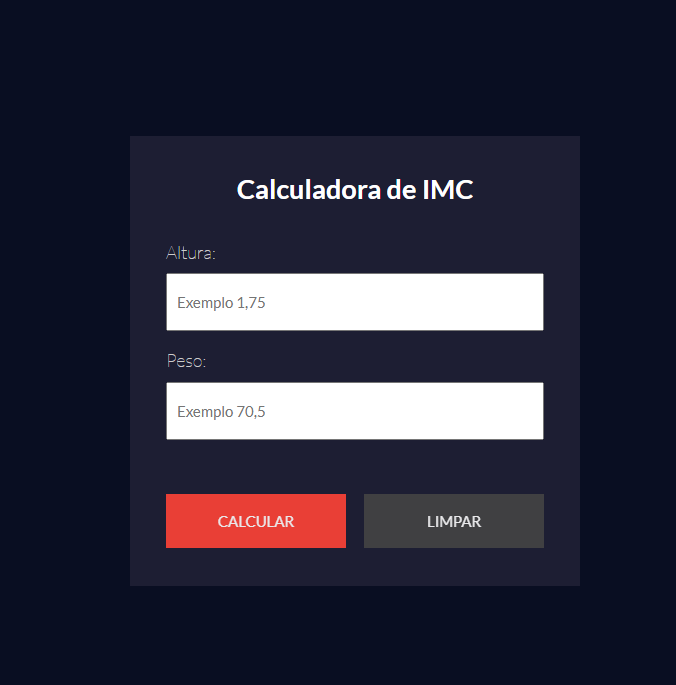

# **Projeto: Calculadora de IMC com React**

## Introdução  
Este projeto tem como objetivo desenvolver uma **calculadora de IMC (Índice de Massa Corporal)** utilizando a biblioteca **React.js**, proporcionando uma aplicação interativa, moderna e com atualização dinâmica de dados. O usuário pode inserir seu peso e altura, e o sistema calcula automaticamente o IMC, exibindo a classificação correspondente.

## Prototipagem  
A estrutura da aplicação foi pensada para ser **simples, funcional e responsiva**, com foco na experiência do usuário. A interface apresenta campos de entrada controlados, resultado imediato e uma tabela de referência com as categorias do IMC.

## Tecnologias Utilizadas  
- **React.js**: Para criação de componentes reutilizáveis e controle do estado da aplicação.  
- **JavaScript (ES6+)**: Lógica de cálculo e manipulação de dados.  
- **CSS3**: Estilização dos componentes com foco em **design responsivo**, **cores indicativas** e **legibilidade**.  
- **Vite / Create React App**: Para estruturação e build do projeto.

## Funcionalidades Principais  
- ✅ Inserção de **peso (kg)** e **altura (m)**  
- ✅ Cálculo automático do IMC ao digitar os dados  
- ✅ Exibição da **classificação do IMC** com destaque visual  
- ✅ Limpeza de campos e reinício do cálculo  
- ✅ Estilo responsivo e compatível com dispositivos móveis  
- ✅ Interface organizada com **componentes funcionais**  

## Objetivos do Projeto  
✔ Praticar o desenvolvimento com **React** utilizando **hooks** como `useState`.  
✔ Aplicar **componentização**, separando lógica e exibição de forma clara.  
✔ Desenvolver um projeto funcional, com **atualização em tempo real**.  
✔ Estimular boas práticas em organização de código e design responsivo.  
✔ Demonstrar como React pode ser aplicado em **projetos simples, porém funcionais**.

Este projeto é ideal para quem está iniciando com React e deseja aprender a **criar interfaces reativas**, **manipular estado**, e desenvolver ferramentas úteis com **JavaScript moderno**.

