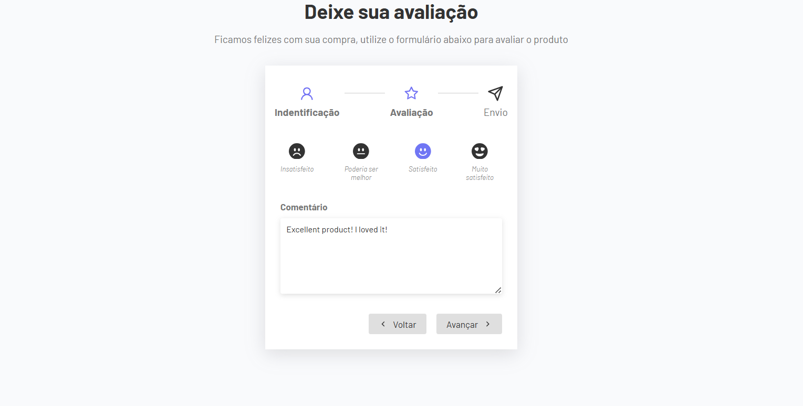

# **Projeto: Formulário de Avaliação com Etapas em React**

## Introdução  
Este projeto consiste na criação de um **formulário de avaliação dividido em três etapas**, desenvolvido com **React.js**. O objetivo é coletar informações do usuário de forma progressiva — como nome, e-mail e feedback — e garantir que os dados preenchidos em cada etapa permaneçam salvos durante a navegação entre as telas.

## Tecnologias Utilizadas  
- **React.js**: Estruturação dos componentes e controle de estado para navegação entre etapas e persistência dos dados.  
- **JavaScript**: Lógica da aplicação, manipulação de dados e validações simples.  
- **React Hooks** (`useState`, `useEffect`): Para gerenciamento de estado local e efeitos colaterais.

## Estrutura do Formulário  
1. **Etapa 1 - Dados Pessoais**  
   - Nome  
   - E-mail  
2. **Etapa 2 - Avaliação**  
   - Nota (por exemplo, emojis ou estrelas)  
   - Comentário opcional  
3. **Etapa 3 - Agradecimento**  
   - Exibição de mensagem personalizada com o nome do usuário  
   - Confirmação de envio da avaliação

## Funcionalidades Principais  
- ✅ Navegação entre etapas sem perder dados preenchidos  
- ✅ Armazenamento local dos dados no estado do React  
- ✅ Interface com **feedback visual** em cada etapa  
- ✅ Componentes reutilizáveis e bem organizados  
- ✅ Validação básica de campos obrigatórios  
- ✅ Estilo limpo e adaptado para mobile e desktop  

## Objetivos do Projeto  
✔ Desenvolver uma **experiência de formulário multi-etapas** com controle total do estado.  
✔ Praticar o uso de **hooks** no React para gerenciamento de dados entre componentes.  
✔ Implementar uma navegação fluida e confiável, sem a necessidade de salvar em banco de dados.  
✔ Aprimorar a **modularização** e reatividade da aplicação com componentes bem estruturados.  
✔ Criar um exemplo prático de **coleta de feedback**, útil em sistemas reais de avaliação.

Este projeto é ideal para entender na prática como gerenciar **estado entre múltiplos componentes**, criar **fluxos de formulário interativos** e oferecer uma experiência rica e contínua ao usuário com **React e JavaScript moderno**.

---