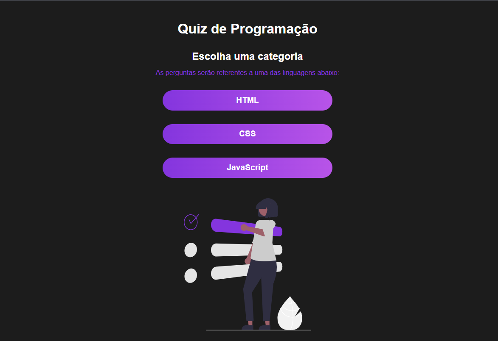

# **Projeto: Quiz Interativo de Programação com React**

## Introdução  
Este projeto tem como objetivo desenvolver um **quiz interativo sobre programação**, utilizando **React.js** e **JavaScript**. A aplicação apresenta perguntas de múltipla escolha sobre temas como HTML, CSS, JavaScript e lógica de programação, fornecendo feedback imediato ao usuário e exibindo a pontuação final ao término do quiz.

## Tecnologias Utilizadas  
- **React.js**: Para a construção de componentes reutilizáveis e controle de fluxo entre as telas do quiz.  
- **JavaScript**: Para lógica de verificação de respostas, pontuação e progresso.  
- **CSS**: Para estilização da interface, com foco em **design responsivo**, cores vibrantes e animações leves.  
- **Hooks do React**: Uso de `useState` e `useEffect` para controle de estado e efeitos durante o jogo.

## Funcionalidades Principais  
- ✅ Tela inicial com botão de "Iniciar Quiz"  
- ✅ Perguntas de múltipla escolha com feedback visual  
- ✅ Controle de progresso (ex: "Pergunta 2 de 5")  
- ✅ Cálculo automático da pontuação final  
- ✅ Tela de resultado com mensagem personalizada  
- ✅ Possibilidade de reiniciar o quiz  

## Objetivos do Projeto  
✔ Criar uma aplicação interativa e educativa utilizando **React e JS**.  
✔ Explorar **controle de estado**, navegação entre componentes e renderização condicional.  
✔ Melhorar a experiência do usuário com **feedback visual** e **interface intuitiva**.  
✔ Aplicar lógica de verificação de respostas e cálculo de pontuação.  
✔ Estimular o aprendizado de programação por meio de um formato leve e divertido.

Este projeto é ideal para praticar os fundamentos do React em uma aplicação dinâmica, com **múltiplas telas, lógica interativa e feedback ao usuário**, além de incentivar o estudo de programação por meio de uma ferramenta prática.

