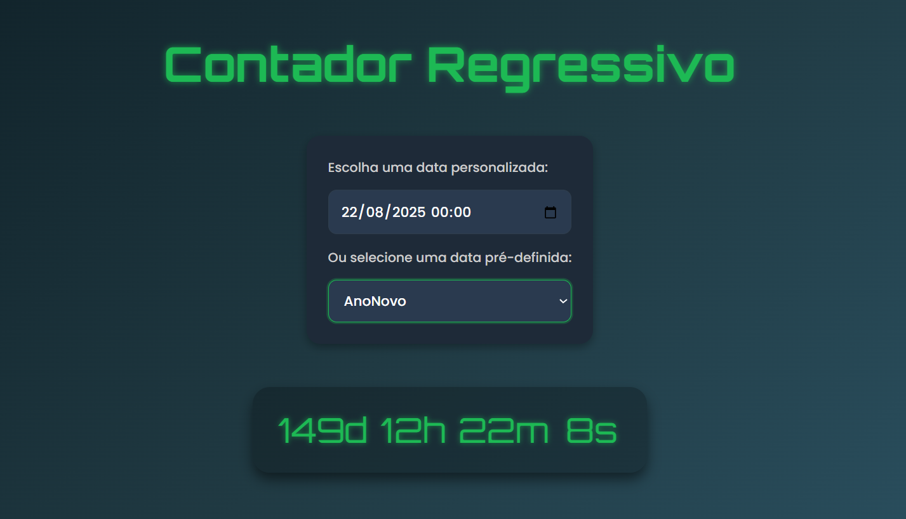

# **Projeto: Contador Regressivo com Seleção de Data – React + Vite**

## Introdução  
Este projeto consiste em um **contador regressivo (countdown timer)** desenvolvido com **React.js** utilizando o **Vite** como bundler para otimizar performance e tempo de desenvolvimento. A aplicação permite ao usuário escolher entre **datas pré-definidas** (como feriados, datas comemorativas ou eventos) ou **definir manualmente uma data e hora personalizada**, e exibe um cronômetro regressivo em tempo real.

## Prototipagem  
O layout é minimalista e responsivo, com destaque para a data selecionada e o tempo restante (dias, horas, minutos e segundos). O design visa ser funcional e direto, com foco em **clareza da informação e personalização da experiência do usuário**.

## Tecnologias Utilizadas  
- **React.js (com Hooks)**: Gerenciamento de estado e atualizações em tempo real usando `useState` e `useEffect`.  
- **Vite**: Build tool leve e rápido para projetos React modernos.  
- **JavaScript (ES6+)**: Para manipulação de datas, intervalos e cálculos.  
- **date-fns ou dayjs** *(opcional)*: Para facilitar a manipulação de datas e formatação.  
- **CSS3 / TailwindCSS** *(opcional)*: Para estilização responsiva e moderna.

## Funcionalidades  
- ✅ Seleção de **datas pré-definidas** (ex: Natal, Ano Novo, Black Friday)  
- ✅ Campo para escolher **qualquer data e hora personalizada**  
- ✅ Exibição do **tempo restante em tempo real**  
- ✅ Feedback quando a contagem chega a zero  
- ✅ **Atualização automática** do tempo a cada segundo  
- ✅ **Design responsivo** e fácil de utilizar  

## Objetivos do Projeto  
✔ Praticar o uso de **React com Vite**, incluindo Hooks como `useState`, `useEffect` e `setInterval`.  
✔ Trabalhar com manipulação e comparação de **datas e horários** em JavaScript.  
✔ Permitir **interação do usuário** com a escolha de datas personalizadas e fixas.  
✔ Criar uma aplicação útil e visualmente atrativa com **atualização em tempo real**.  
✔ Explorar conceitos de **componentização** e **estilização dinâmica**.

Este projeto é excelente para reforçar habilidades com **tempo real, datas e timers** em React, além de oferecer flexibilidade e uma base sólida para personalizações como alarmes, lembretes e contagens para eventos.

---
